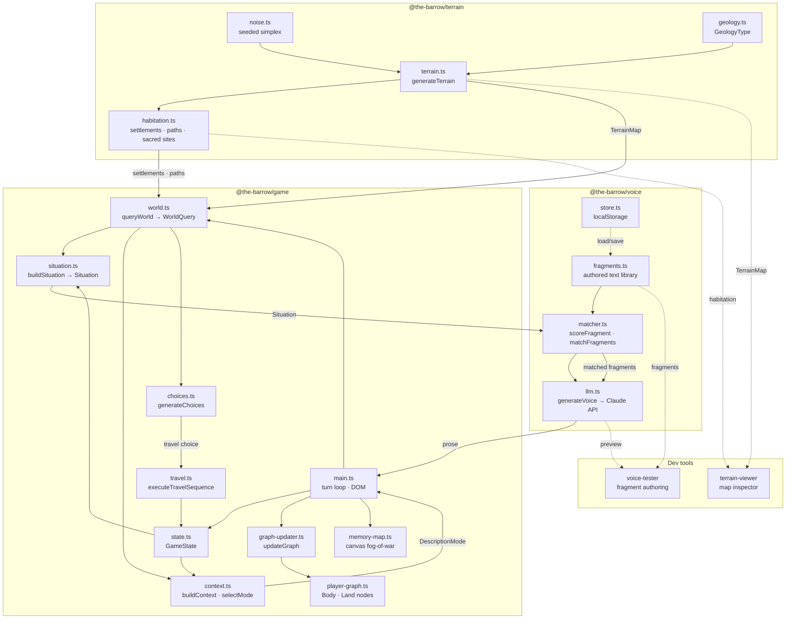

# The Barrow — System Design

> Keep this file up to date. After every significant architectural change, update the summary, directory structure, and flowchart below.

---

## High-Level Summary

*The Barrow* is a text-based walking exploration game set in a prehistoric British landscape. The player wanders a procedurally generated terrain and receives LLM-generated atmospheric descriptions keyed to their immediate perceptual environment.

The system has three layers:

1. **Terrain** (`@the-barrow/terrain`) — Generates the world. Noise-based altitude, geology, rivers, settlements, sacred sites, and path networks. Pure data; no UI.
2. **Voice** (`@the-barrow/voice`) — Generates prose. A library of authored text fragments is filtered by situational tags (geology, weather, season, time, altitude, etc.) and sent to Claude to be woven into atmospheric descriptions. No game logic.
3. **Game** (`@the-barrow/game`) — The player loop. Owns game state, movement, travel sequences, the player graph (a hidden skill system), and the UI. Bridges terrain and voice by translating world position into a `Situation` and piping matched fragments to the LLM.

Two standalone dev tools exist: **terrain-viewer** (visual map inspector) and **voice-tester** (fragment authoring/testing UI).

---

## Directory Structure

```
the-barrow/
├── packages/
│   ├── terrain/               # @the-barrow/terrain — world generation
│   │   └── src/
│   │       ├── noise.ts       # Seeded simplex noise + layered octaves
│   │       ├── geology.ts     # GeologyType enum + display info
│   │       ├── terrain.ts     # generateTerrain() → TerrainMap (altitude, geology, rivers, coast)
│   │       ├── habitation.ts  # Settlements, sacred sites, path network, wight territories
│   │       └── index.ts       # Re-exports everything
│   │
│   ├── voice/                 # @the-barrow/voice — prose generation
│   │   └── src/
│   │       ├── tags.ts        # TAGS constant, Situation interface
│   │       ├── fragments.ts   # Fragment type, STARTER_FRAGMENTS data
│   │       ├── matcher.ts     # scoreFragment(), matchFragments(), countScoredFragments()
│   │       ├── llm.ts         # generateVoice() — calls Claude API with fragments + situation
│   │       ├── store.ts       # localStorage persistence for fragments and API key
│   │       └── index.ts       # Re-exports everything
│   │
│   ├── game/                  # @the-barrow/game — player loop and UI
│   │   └── src/
│   │       ├── main.ts        # Entry point: init, turn loop, DOM wiring
│   │       ├── state.ts       # GameState interface, createInitialState(), advanceTime()
│   │       ├── world.ts       # queryWorld() → WorldQuery (what's at position x,y)
│   │       ├── situation.ts   # buildSituation() — WorldQuery+GameState → voice Situation
│   │       ├── context.ts     # buildContext(), selectMode() — perceptual mode selection
│   │       ├── choices.ts     # generateChoices() — directional + feature choices
│   │       ├── travel.ts      # executeTravelSequence() — multi-cell movement with interrupts
│   │       ├── player-graph.ts # PlayerGraph — hidden Body/Land skill nodes (0–1 floats)
│   │       ├── graph-updater.ts # updateGraph() — increments nodes based on each turn's events
│   │       ├── memory-map.ts  # Canvas-based fog-of-war map with anchors and visited trails
│   │       └── debug-panel.ts # Dev overlay showing graph values and state
│   │
│   ├── terrain-viewer/        # @the-barrow/terrain-viewer — dev map tool
│   │   └── src/
│   │       ├── main.ts        # UI: seed input, layer toggles, habitation overlay
│   │       ├── renderer.ts    # Canvas renderer for terrain + habitation layers
│   │       └── worker.ts      # Web worker for off-thread terrain generation
│   │
│   └── voice-tester/          # @the-barrow/voice-tester — dev fragment tool
│       └── src/
│           └── main.ts        # UI: fragment CRUD, situation builder, live LLM preview
│
├── package.json               # npm workspaces root
├── tsconfig.base.json         # Shared TS compiler options
├── tsconfig.json              # Project references
└── CLAUDE.md                  # This file
```

---

## Component Flowchart



---

## Key Design Decisions

- **Fragment-first prose**: All atmospheric text starts from a library of short authored fragments. The LLM weaves them — it never invents terrain facts. This keeps descriptions grounded and controllable.
- **DescriptionMode**: Context comparison (`selectMode`) gates how much the LLM writes per turn. `full` (3–6 sentences) only fires on major perceptual changes; `movement` (1–2 sentences) is the default. Prevents repetition.
- **PlayerGraph is hidden**: Skill nodes (Body/Land tier) are never shown to the player. They influence description unlocks and choices without surfacing as stats.
- **Travel sequences**: Directional movement is multi-cell. `travel.ts` walks cells until an interrupt condition fires (geology change, river crossing, sacred site visible, etc.), then the game describes the arrival point, not every step.
- **Web worker for terrain**: The terrain-viewer offloads generation to a worker so the main thread stays responsive. The game generates once at startup on the main thread (map is small enough).
